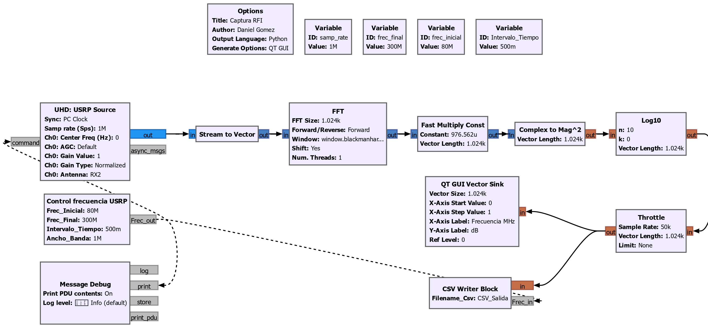
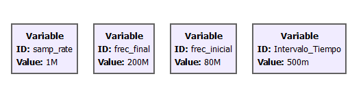
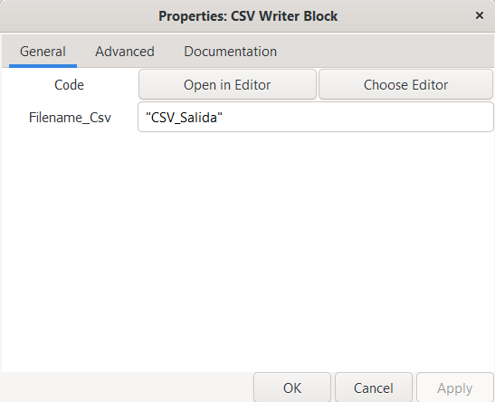
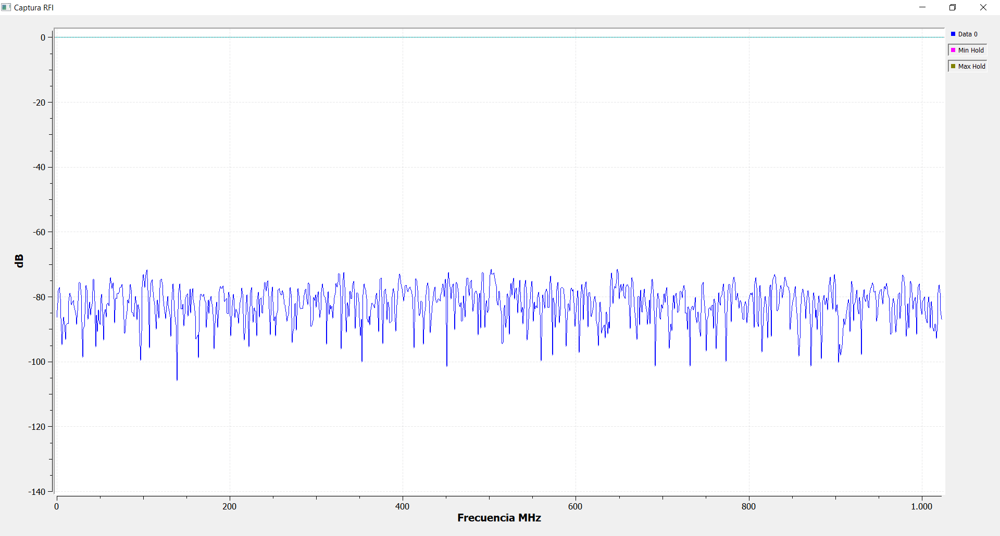
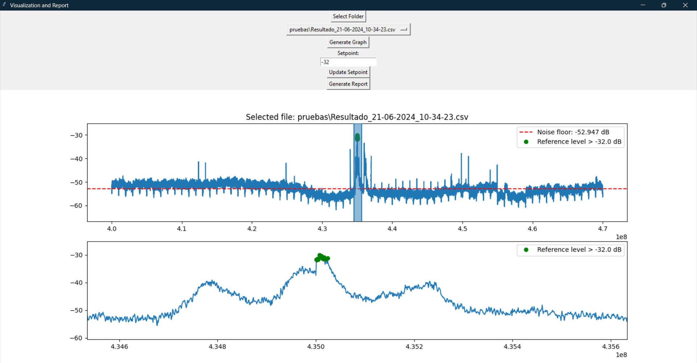

# RFI Tracker

## **Descripción:**

Este repositorio contiene el desarrollo de un Medidor Autónomo de Interferencia de Radiofrecuencia (RFI) con el propósito facilitar la selección de sitios idóneos y la caracterización del RFI.

Un medidor de RFI es un dispositivo diseñado para evaluar la presencia y la intensidad de las interferencias electromagnéticas en el espectro de radiofrecuencia. Estas interferencias, generadas por fuentes artificiales como dispositivos electrónicos, comunicaciones inalámbricas y otras emisiones no deseadas, pueden afectar significativamente las observaciones radio astronómicas. El medidor de RFI identifica y cuantifica estas interferencias, permitiendo la caracterización del entorno electromagnético.

## **Contenido del repositorio:**

<!-- se crea una sub-carpeta llamada **"Muestras"** seguida del mismo nombre del archivo csv, y en ella se guardan las muestras ya tratadas de dicho archivo. También se crea otra sub-carpeta llamada **"Resultados"** seguida del nombre del mismo csv, donde se almacena el posprocesamiento junto con un archivo csv que contiene dos datos resultantes y relevantes. 

En esta carpeta también se encuentra el código encargado del pos-procesamiento con el nombre de [Tratado_datos.py](/Salida/Tratado_Datos.py), del cual existen dos versiones: una desarrollada en Python y otra con el mismo nombre en Jupyter. -->

[1. GNU-RADIO: ](/Captura_RFI_1.0.grc) Programa desarrollado en GNU-Radio para la adquisición, registro y procesamiento de las señales de RF. Al iniciar el programa por primera vez, se generarán tres códigos:

- [**Captura_RFI.py**](/Captura_RFI.py): Este es el archivo general que contiene todo lo del programa.
- [**Captura_RFI_Control_Frecuencia.py**](/Captura_RFI_Control_Frecuencia.py): Código encargado de hacer el salto de frecuencia y desarrollado para el cambio de frecuencia en la tarjeta USRP B200 mediante "Polymorphic Types" (PMT).
- [**Captura_RFI_CSV.py**](/Captura_RFI_CSV.py): Este es el encargado de guardar en un archivo csv los datos de potencia tomados por la USRP y lo guardará con el nombre de "CSV_Salida_d-m-Y_H-M-S.csv". Este nombre incluye la fecha y hora (día, mes, año, hora, minuto y segundo) para facilitar el seguimiento de las muestras tomadas.

[2. Medidor_RFI.py: ](/Medidor_RFI.py) Interfaz gráfica, que también se utilizó para crear el ejecutable .exe.

[3. Tratado_Datos.py: ](Tratado_Datos.py) Código encargado del post-procesamiento de los datos adquiridos.

[4. Visualización_Datos.py: ](Visualizacion_Datos.py) Código encargado de la visualización de los datos después del post-procesamiento y generador de reportes.

[5. requirements.txt: ](requirements.txt) Lista de dependencias necesarias para ejecutar el programa.

## **Requisitos:**

Para usar el programa, es necesario tener instalado Python (preferiblemente versiones superiores a la 3.8). Además, asegúrese de tener instalados los drivers para la SDR que va a usar, en este caso se utilizó la USRP.

## **Instalación:**

1) **Descargar el ejecutable:** Descargue el archivo ejecutable .exe desde la sección de [releases](https://github.com/ERA-2022/Captura-RFI/releases).

2) **Ejecutar el instalador:** Ejecute el archivo descargado. No es necesario descargar nada más, solo tener Python instalado. Desde el instalador, tendrá la opción de instalar GNU Radio si aún no lo tiene instalado.

## **Instrucciones de Uso:**

Para usar el programa, lo único que se requiere es tener GNU Radio, preferiblemente versiones superiores a la 3.8. Desde la interfaz, puede instalar GNU Radio si no lo tiene, utilizando el botón **"Install GNU Radio"**. Luego, deberá cargar el flujo-grama creado para el medidor con el botón **"Load RF Meter"**. Seleccione la carpeta donde desea guardar este archivo .grc. Abra el programa llamado [**Captura_RFI.grc**](/Captura_RFI.grc). Al iniciar el programa correctamente, los demás códigos se generarán automáticamente: [**Captura_RFI.py**](/Captura_RFI.py), [**Captura_RFI_Control_Frecuencia.py**](/Captura_RFI_Control_Frecuencia.py) y [**Captura_RFI_CSV.py**](/Captura_RFI_CSV.py). 

   

1. Dentro del programa [Captura_RFI.grc](/Captura_RFI.grc) en la parte superior encontrara el apartado de variables en esté se encuentran cuatro variables que son las encargadas de configurar la adquisición de las señales RF, la variable samp_rate hace referencia al ancho de banda que tomara por cambio de frecuencia, como fue explicado, la variable frec_inicial y frec_final establecen en rango de frecuencia que sera analizado y la variable Intervalo_Tiempo se refiere al tiempo que analizara cada segmento antes de pasar a la siguiente frecuencia central.

    

2. Dentro del mismo flujograma de GNU-Radio encontrara un bloque con el nombre de CSV writer Block, dentro de este podra cambair el nombre del archivo csv que se genera, este le seguirá "d-m-Y_H-M-S.csv". Este nombre incluye la fecha y hora (día, mes, año, hora, minuto y segundo). 

    

3. Adquisición: Al ejecutar el programa desde GNU Radio, se visualizará en tiempo real la señal de RF que está siendo captada, mostrando los diferentes saltos de frecuencia que se están realizando. Para detener la captura de datos y finalizar la grabación, se debe cerrar la ventana del programa en GNU Radio. Al hacer esto, el programa generará automáticamente un archivo csv en la carpeta correspondiente, con el nombre que incluye la fecha y hora del inicio de la captura. Este archivo csv contendrá todos los datos de potencia registrados durante la sesión.

    

4. Post-procesamiento: Dentro de la interfaz, con el botón Post-processing" podrá empezar este proceso. Solo debe seleccionar el archivo CSV generado por [Captura_RFI.grc](/Captura_RFI.grc), y el sistema guardará las muestras y los resultados en la misma carpeta. Este realiza el posprocesamiento de datos de potencia capturados y guardados en un archivo CSV. Primero, carga y limpia los datos eliminando valores nulos y específicos. Luego, divide los datos en grupos basados en cambios de frecuencia y guarda estos grupos en archivos CSV individuales. Posteriormente, transpone los datos para reorganizarlos, filtra las columnas necesarias, concatena los archivos por muestra, ajusta las frecuencias y calcula máximos de dB para cada frecuencia. 

5. Visualización y Generación de Reportes: Dentro de la interfaz, con el botón **"Visualización de Gráfica"** podrá observar los resultados del post-procesamiento. Puede aumentar la gráfica, es decir, seleccionar una sección y verla con más detalle. Primero, seleccione la carpeta que contiene el archivo de resultados generado por el post-procesamiento. Luego, en esta sección, podrá ver la gráfica con el piso de ruido (el promedio donde se mantienen los dBs). Puede establecer un nivel de referencia (setpoint) que desea ver en la gráfica y, finalmente, generar un reporte que incluirá los datos importantes y las frecuencias que superan el nivel de referencia. Este reporte se guardará en un nuevo archivo CSV en la misma carpeta.

    
    <!-- *Figura 1: Resultados del post-procesamiento del medidor de RFI.* -->

<!-- La adquisición de datos se divide en muestras como se observa en siguiente la imagen:

Esto es debido a que la tarjeta USRP cuenta con un ancho de banda limitado de 200 KHz a 56 MHz y en la adquisición se requieren analizar un ancho de banda mas amplio por lo cual se desarrollo el programa [Control frecuencia](/Control_Frecuencia.py) que esta encargado de recibir una frecuencia inicial y final y dividirla en muestra iguales con un mismo ancho de banda.  -->

